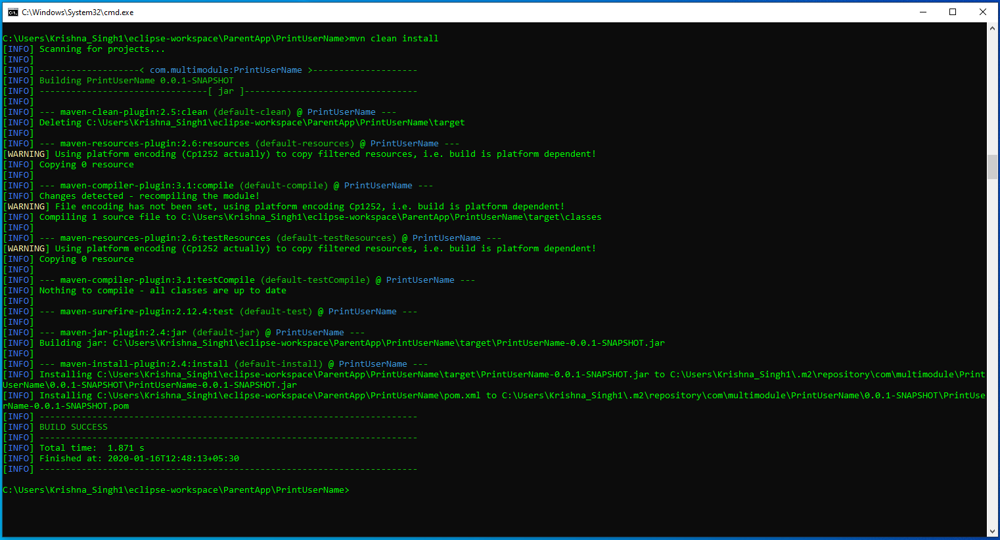
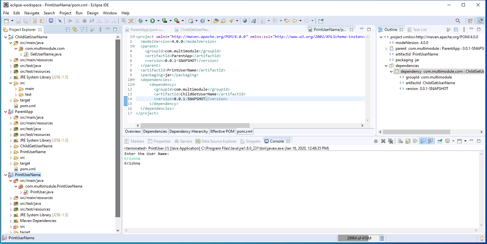

# Implementation of Maven Multi-Module Project.  
-----------------------

## Maven Multi-Module

A multi-module project is built from an aggregator POM that manages a group of submodules. In most cases, the aggregator is located in the project's root directory and must have packaging of type pom.

Now, the submodules are regular Maven projects, and they can be built separately or through the aggregator POM.

By building the project through the aggregator POM, each project that has packaging type different than pom will result in a built archive file.

## Benefits of Maven Multi-Module Project

* One single maven command to build all your modules at once.
* Most important : maven take care of the build order for you.
* Configuring or deploy your  project on server is also very easy.
* You can re-use the code from the modules across different projects. Let’s assume your project contains some well-written generic-enough code for mail sending. If you later have another project that need mail sending functionality, you can simply re-use your existing module or build upon it (in another module by adding it as a dependency).

## Project Structure

* ParentApp -> ChildGetUserName    -> pom    
&emsp; &emsp; &emsp;&emsp; &nbsp;  -> PrintUserName          -> pom  
&emsp; &emsp; &emsp;&emsp; &nbsp;    	-> pom

* PrintUserName has dependency of ChildGetUserName where PrintUserName call ChildGetUserName to get username in Input and Send values back to the PrintUserName to print.

* Dependencies are added in PrintUserName pom.

## How to setup(With Screenshots): 

1. Clone the project. 
2. Then run "mvn clean install" in ParentApp, ChildGetUserName, PrintUserName

  

3. Run project 

  

Note: "mvn clean install" should be run after clonning project.

**Created by:**  
**Name: Krishna Kumar Singh**  
**Email: krishnaai265@gmail.com**  
**Phone: +91-9368754996** 
